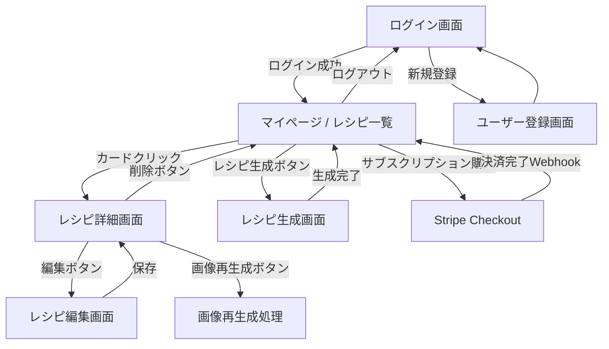
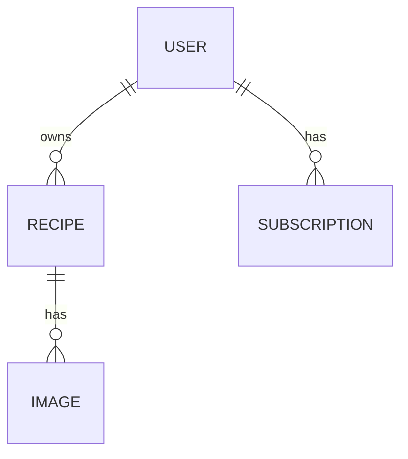
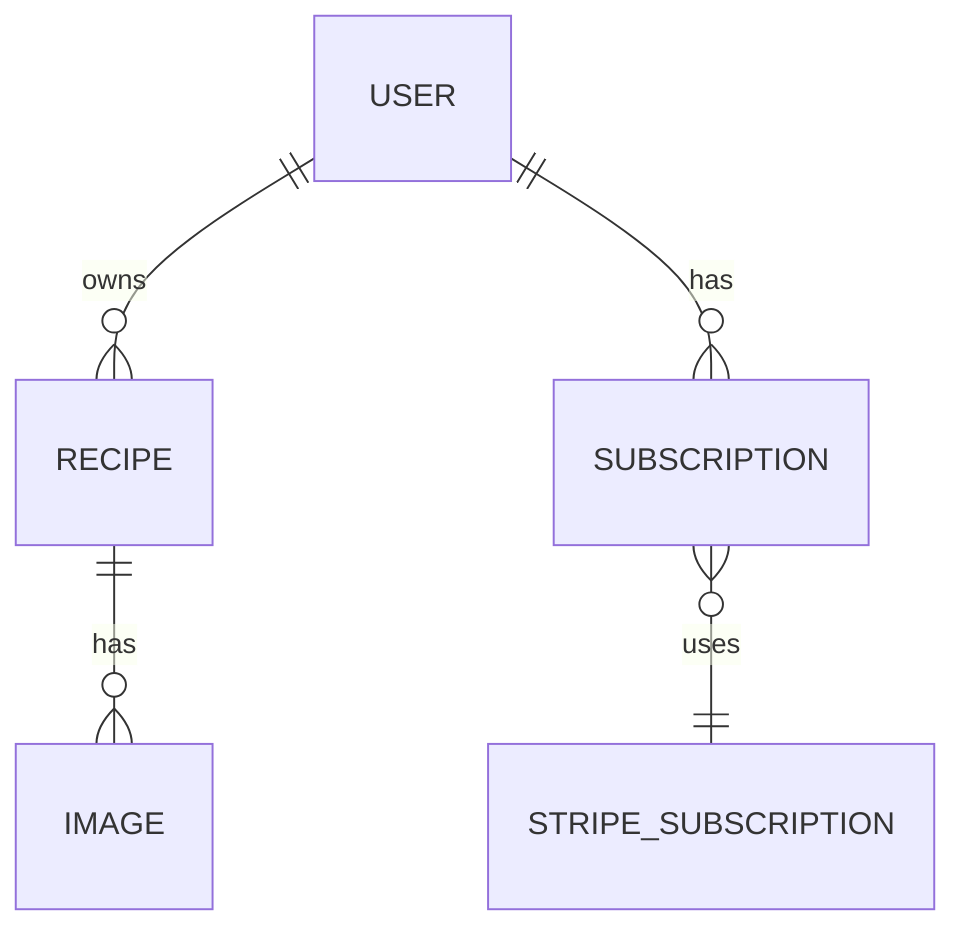

了解しました！いただいた内容を整理して、READMEっぽく読みやすい形にリライトしました。

---

# レシピ生成AIアプリ

本アプリは **AIを活用して1日の栄養素を満たすレシピを自動生成** するサービスです。
生成されたレシピは Markdown 形式で保存され、画像の生成・再生成、編集、削除が可能です。
サブスクリプション購入後にレシピ生成機能を利用でき、認証は JWT を採用しています。

---

## 主な特徴

* **AIレシピ生成**: 一食分または朝昼晩の3食分を自動生成

* **レシピ管理機能**: 保存・編集・削除・画像再生成対応
* **認証 & サブスクリプション**: JWT認証（token endpoints 実装）と Stripe での課金連携（Checkout + Webhook の受信）
* **ユーザー画面**: 一覧画面・詳細画面・ユーザーページを用意

---

使用技術に基づいた補足

* Python (FastAPI)
→ API 実装（認証、レシピ、画像、サブスク）。

* SQLite (開発用)
→ ローカル開発では `src/app.db`（SQLite）を使用します。プロダクションでの DB は構成により差し替えてください。

* Azure OpenAI
→ レシピ生成に Azure OpenAI クライアントを利用するコードが含まれます。

* Terraform
→ インフラを構成するための Terraform 構成がリポジトリに含まれます（オプション）。

* SQLAlchemy
→ ORMでレシピ・ユーザー・サブスクリプションのモデリング。

* Stripe
→ サブスクリプション課金処理（Checkout + Webhook）。
    プランは Stripe 側で管理する運用を想定しており、アプリは Stripe の Price ID（例: `price_1Abc...`）を受け取って Checkout セッションを作成します。
    Webhook で受信したイベントから Stripe API を使って subscription 情報を取得し、アプリ内の Subscription を更新します。

---

## 画面遷移図



---

## ER図（簡易）



---

## 設計上の考慮点

* **工程制限**: 調理手順は最大3ステップ
* **生成フロー**: レシピ生成時にMarkdown＋画像を保存、編集で更新可能
* **画像再生成**: 過去履歴を保持しつつ再生成可能
* **JWT認証**: DBには `password_hash` を保持し、JWTで認証管理
* **Stripe連携**: `SUBSCRIPTION` + `STRIPE_PLAN` で課金情報を管理
* **Stripe連携**: Checkout（price_id） + Webhook で課金情報を管理

---

## API エンドポイント設計
以下は現在実装されているエンドポイントです（各ルーターは `src/main.py` で以下の prefix にマウントされています：`/api/auth`, `/api/recipe`, `/api/payments`）。

### 認証 (prefix: /api/auth)

* `POST /api/auth/token` — OAuth2 token 発行（フォームデータ）
* `POST /api/auth/create-user` — ユーザー作成（管理用）
* `POST /api/auth/login` — ログイン（メール・パスワードでトークン生成）
* `POST /api/auth/logout` — ログアウト（ダミー）
* `GET /api/auth/user` — 自分のユーザー情報取得

### レシピ (prefix: /api/recipe)

* `POST /api/recipe/create-recipe` — AIによるレシピ生成（認可・要トークン）
* `GET /api/recipe/user-recipes` — ログインユーザーのレシピ一覧（認可・要トークン）
* `GET /api/recipe/recipe/{recipe_id}` — レシピ詳細取得（認可・要トークン）
* `PUT /api/recipe/recipe/{recipe_id}` — レシピ編集（認可・要トークン）
* `DELETE /api/recipe/recipe/{recipe_id}` — レシピ削除（認可・要トークン）

### サブスクリプション / 決済 (prefix: /api/payments)

* `GET /api/payments/plans` — （現状）DB に登録されているプラン一覧を返す（実装ありが未使用の場合あり）
* `POST /api/payments/create-checkout-session` — Stripe Checkout セッション作成（`price_id` を受け取り Checkout を作成）
* `POST /api/payments/webhook` — Stripe Webhook 受信（checkout.session.completed, subscription, invoice イベントを処理）

注: 多くのエンドポイントは認可（JWT Token）を必要とします。Checkout 作成はサーバーで `stripe.Price.retrieve` による価格確認を行い、metadata に `plan_id`（price id）を付与する実装です。

### 環境変数


最低限設定すべき環境変数:

- `STRIPE_API_KEY` — Stripe シークレットキー（テスト/本番を使い分ける）
- `STRIPE_WEBHOOK_SECRET` — Stripe Webhook の署名検証用シークレット（本番必須）
- `STRIPE_SUCCESS_URL` — Checkout 成功時のリダイレクト先
- `STRIPE_CANCEL_URL` — Checkout キャンセル時のリダイレクト先

（その他は既存の `.env` を参照）

## Webhook のローカルテスト（stripe CLI）

開発中に Stripe の webhook をローカルで受け取って検証するには `stripe` CLI を使うのが簡単です。以下は推奨手順です。

1. `.env.sample` をコピーして `.env` を作成し、必要な値を埋める（特に `STRIPE_API_KEY` を設定）:

```bash
cp .env.sample .env
# エディタで .env を開き STRIPE_API_KEY を設定してください
```

2. アプリを起動（例: uvicorn）:

```bash
uvicorn src.main:app --reload --port 8000
```

3. 別ターミナルで stripe CLI を使って webhook を転送する:

```bash
stripe listen --forward-to localhost:8000/api/payments/webhook
```

`stripe listen` を実行すると出力に `Webhook signing secret:` の行が表示されます（例: `whsec_...`）。その値をコピーして `.env` の `STRIPE_WEBHOOK_SECRET` に設定するか、同じターミナルで環境変数をエクスポートしてください。例:

```bash
# 出力された secret を環境変数に設定（例）
export STRIPE_WEBHOOK_SECRET=whsec_xxx
# または .env に追記
```

4. テストイベントを送る（stripe CLI）:

```bash
stripe trigger checkout.session.completed
```

`stripe trigger` は署名付きのテストイベントを送ってくれるので、サーバー側の `stripe.Webhook.construct_event` による検証が通るはずです。もし署名検証でエラーになる場合は、`stripe listen` の出力で得た `whsec_...` を正しく設定しているか、受け取り先 URL が `localhost:8000/api/payments/webhook` と一致しているかを確認してください。

開発上の注意点:

- 本番では必ず `STRIPE_WEBHOOK_SECRET` を設定して署名検証を有効にしてください。
- Postman 等で直接 POST する場合は `stripe-signature` ヘッダを自分で生成できないため検証に失敗します。開発時は stripe CLI を使って署名付きリクエストを作成してください。
- ログにリクエスト本体・ヘッダを出したい場合は開発用に限定してログ出力を追加してください（個人情報・カード情報は絶対にログに残さないでください）。

### ER図（サブスクリプション周りの簡易）


