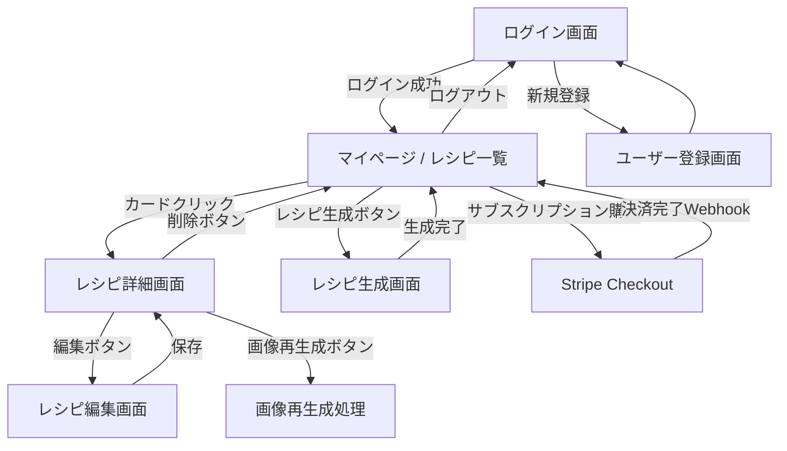
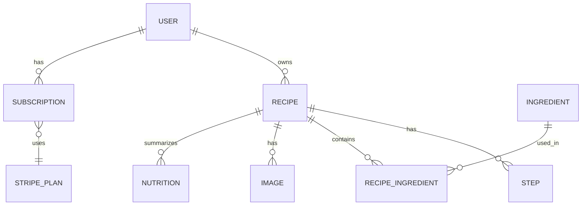

了解しました！いただいた内容を整理して、READMEっぽく読みやすい形にリライトしました。

---

# レシピ生成AIアプリ

本アプリは **AIを活用して1日の栄養素を満たすレシピを自動生成** するサービスです。
生成されたレシピは Markdown 形式で保存され、画像の生成・再生成、編集、削除が可能です。
サブスクリプション購入後にレシピ生成機能を利用でき、認証は JWT を採用しています。

---

## 主な特徴

* **AIレシピ生成**: 一食分または朝昼晩の3食分を自動生成
* **調理工程は最大3ステップ**: シンプルな手順で栄養を確保
* **栄養素チェック**: 1日の推奨栄養素を満たしているか判定
* **レシピ管理機能**: 保存・編集・削除・画像再生成対応
* **認証 & サブスクリプション**: JWT認証とStripeでの課金連携
* **ユーザー画面**: 一覧画面・詳細画面・ユーザーページを用意

---

使用技術に基づいた補足

* Python (FastAPI)
→ API 実装（認証、レシピ、画像、サブスク）。

* Azure PostgreSQL
→ レシピ・ユーザー・サブスクリプション情報の永続化。

* Azure Key Vault
→ JWTシークレット、Stripe APIキー、DB接続情報の管理。

* Azure Container App + ACR
→ FastAPIアプリのDockerイメージをACRにpush → Container Appで稼働。

* Terraform
→ PostgreSQL、Key Vault、Container App、ACR、ネットワークなどIaCで管理。

* SQLAlchemy
→ ORMでレシピ・ユーザー・サブスクリプションのモデリング。

* Stripe
→ サブスクリプション課金処理（Webhookも必須）。

---

## 画面遷移図

---

## ER図

---

## 設計上の考慮点

* **工程制限**: 調理手順は最大3ステップ
* **食事スコープ**: 一食 or 朝昼晩セットを指定可能
* **生成フロー**: レシピ生成時にMarkdown＋画像を保存、編集で更新可能
* **画像再生成**: 過去履歴を保持しつつ再生成可能
* **JWT認証**: DBには `password_hash` を保持し、JWTで認証管理
* **Stripe連携**: `SUBSCRIPTION` + `STRIPE_PLAN` で課金情報を管理
* **栄養判定**: AI or ロジックにより1日栄養素を満たすかフラグを設定

---

## API エンドポイント設計

### 認証 (Auth)

* `POST /auth/register` — ユーザー登録
* `POST /auth/login` — ログイン（JWT発行）
* `GET /auth/me` — 自分の情報取得

### レシピ (Recipes)

* `POST /recipes/generate` — AIでレシピ生成（要サブスク）
* `GET /recipes` — ログインユーザーのレシピ一覧
* `GET /recipes/{id}` — レシピ詳細取得
* `PUT /recipes/{id}` — レシピ編集
* `DELETE /recipes/{id}` — レシピ削除

### レシピ画像 (Images)

* `POST /recipes/{id}/images/regenerate` — レシピ画像再生成
* `GET /recipes/{id}/images` — 画像一覧取得

### 栄養素 (Nutrition)

* `GET /recipes/{id}/nutrition` — 栄養素情報取得

### サブスクリプション (Stripe)

* `POST /subscriptions/create-checkout-session` — Stripe Checkout セッション作成
* `POST /subscriptions/webhook` — Stripe Webhook受信
* `GET /subscriptions/me` — 自分のサブスクリプション情報取得
