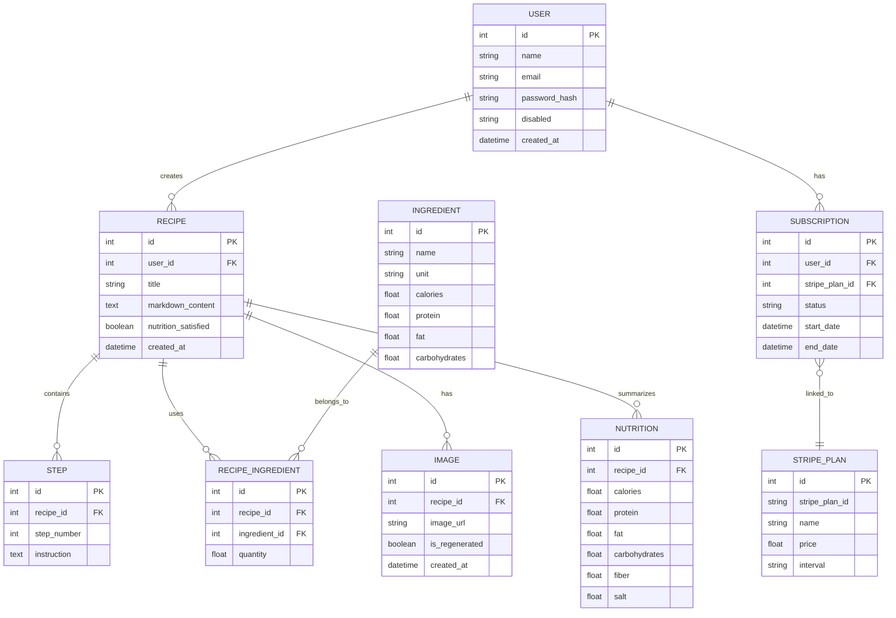

ER

```mermaid
erDiagram

    USER {
        int id PK
        string name
        string email
        string password_hash
        string disabled
        datetime created_at
    }

    RECIPE {
        int id PK
        int user_id FK
        string title
        text markdown_content
        boolean nutrition_satisfied
        datetime created_at
    }

    STEP {
        int id PK
        int recipe_id FK
        int step_number
        text instruction
    }

    INGREDIENT {
        int id PK
        string name
        string unit
        float calories
        float protein
        float fat
        float carbohydrates
    }

    RECIPE_INGREDIENT {
        int id PK
        int recipe_id FK
        int ingredient_id FK
        float quantity
    }

    IMAGE {
        int id PK
        int recipe_id FK
        string image_url
        boolean is_regenerated
        datetime created_at
    }

    NUTRITION {
        int id PK
        int recipe_id FK
        float calories
        float protein
        float fat
        float carbohydrates
        float fiber
        float salt
    }

    SUBSCRIPTION {
        int id PK
        int user_id FK
        int stripe_plan_id FK
        string status
        datetime start_date
        datetime end_date
    }

    STRIPE_PLAN {
        int id PK
        string stripe_plan_id
        string name
        float price
        string interval
    }

    %% 関係定義
    USER ||--o{ RECIPE : "creates"
    USER ||--o{ SUBSCRIPTION : "has"
    RECIPE ||--o{ STEP : "contains"
    RECIPE ||--o{ RECIPE_INGREDIENT : "uses"
    INGREDIENT ||--o{ RECIPE_INGREDIENT : "belongs_to"
    RECIPE ||--o{ IMAGE : "has"
    RECIPE ||--o{ NUTRITION : "summarizes"
    SUBSCRIPTION }o--|| STRIPE_PLAN : "linked_to"
```
